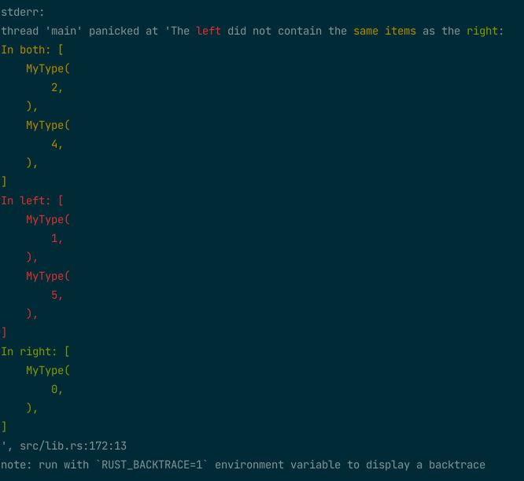

# assert_unordered

[](https://crates.io/crates/assert_unordered)
[](https://docs.rs/assert_unordered)

A direct replacement for `assert_eq` for unordered collections

This macro is useful for any situation where the ordering of the collection doesn't matter, even
if they are always in the same order. This is because the stdlib `assert_eq` shows the entire
collection for both left and right and leaves it up to the user to visually scan for differences.
In contrast, this crate only works with collections (types that implement `IntoIterator`) and
therefore can show only the differences (see below for an example of what the output looks like).

NOTE: As of 0.3.2, the output by default is in color similar to `pretty_assertions`

## Usage

NOTE: `no-default-features` can be used to disable color output (and enable `no-std` support)

```toml
[dev-dependencies]
assert_unordered = "0.3"
```

# Which Macro?

TLDR; - favor `assert_eq_unordered_sort` unless the trait requirements can't be met

* [assert_eq_unordered](https://docs.rs/assert_unordered/0.3.3/assert_unordered/macro.assert_eq_unordered.html)
    * Requires only `Debug` and `PartialEq` on the elements
    * Collection level equality check, and if unequal, falls back to item by item compare (O(n^2))
* [assert_eq_unordered_sort](https://docs.rs/assert_unordered/0.3.3/assert_unordered/macro.assert_eq_unordered_sort.html)
    * Requires `Debug`, `Eq` and `Ord` on the elements
    * Collection level equality check, and if unequal, sorts and then compares again, 
      and if still unequal, falls back to item by item compare (O(n^2))


## Example
```rust, should_panic
use assert_unordered::assert_eq_unordered;

#[derive(Debug, PartialEq)]
struct MyType(i32);

fn main() {
    let expected = vec![MyType(1), MyType(2), MyType(4), MyType(5)];
    let actual = vec![MyType(2), MyType(0), MyType(4)];

    assert_eq_unordered!(expected, actual);
}
```

Output:



## License

This project is licensed optionally under either:

* Apache License, Version 2.0, (LICENSE-APACHE
  or https://www.apache.org/licenses/LICENSE-2.0)
* MIT license (LICENSE-MIT or https://opensource.org/licenses/MIT)
